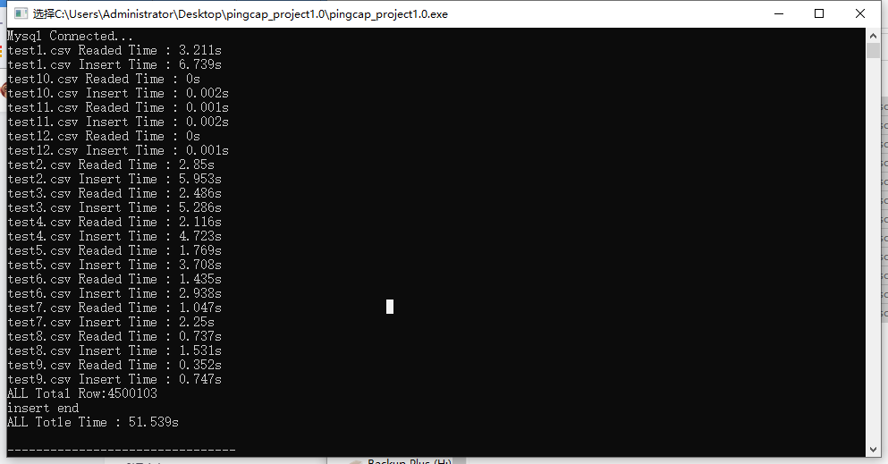

# 项目

给定若干大小的 CSV 格式的文件，请实现一个程序将它们尽快导入至 mysql 数据库中。
假设需要处理的文件数量1 <= n <= 100, 每个文件大小 0 < s < 100MB

说明:
table schame 可固定为：

CREATE TABLE test_schema (
  `filed1` varchar(32), 
  `filed2` varchar(32),
  `filed3` varchar(32),
  `filed4` varchar(32),
  `filed5` varchar(32),
);

输入的 csv 文件可以认为格式已经列数和 schema 总是匹配，可以不用考虑数据解析失败的情况。

输入：

一个文件目录包含需要导入的所有文件，已经 mysql 的连接地址

输出：
写入至 mysql 数据的总行数（可以输出到标准输出，或 log中）

# 整体思路

* 直接数据流导入内容，然后解析csv文件
* 100m的csv文件可能有上百万行数据，我们不可能逐条插入，因此我进行了以下优化
  * 开事务，防止频繁自动提交
  * 关索引
  * 批量插入
* 整个程序大致分为两步
  * 读取csv文件
  * 插入数据库
* 以上就是我的思路

# 测试条件

* 12个CSV文件
* 总共534M
* 其中最大为109M，900,000行数据
* 全部数据都是随机生成，在32位字符串内容以内

# 结果

1. 109M的读取时间为3.211s，插入数据库的总时间为6.739s

2. 全部结果展示如下图

   

   

3. 总共花费51.539s，总行数为450万行数据插入，均成功插入
